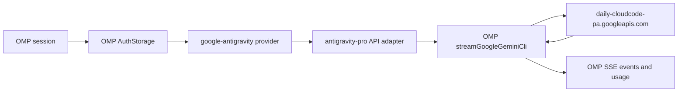

# omp-antigravity-pro: complete guide

[Main README](../README.md) | [Русская версия](GUIDE.ru.md)

## 1. Purpose

`omp-antigravity-pro` is an Oh My Pi extension for the built-in `google-antigravity` provider. It enables Google Antigravity models (Gemini Flash, Pro, Claude, GPT-OSS) with budget-based thinking, automatic zero-code adaptation for latest and future Gemini models, and production daily endpoint routing, without replacing OMP's authentication, account scheduler, request transport, or stream parser.

The extension exists because Antigravity's production Cloud Code Assist endpoint expects Gemini Flash effort tiers as wire-model IDs with numeric `thinkingBudget` values. Stock OMP catalogs can describe Gemini models with Google's `thinkingLevel` protocol, which produces empty responses on Antigravity. Additionally, this extension automatically discovers and adapts current and future Gemini models without requiring manual plugin updates.

## 2. Design



The provider ID remains `google-antigravity`. This is deliberate: existing OAuth credential rows, `/usage`, account cooldowns, session stickiness, and failover all remain associated with the same provider.

The extension registers a separate custom API ID, `antigravity-pro`, because OMP reserves built-in API identifiers. Before delegation, the adapter restores the stock `google-gemini-cli` API and the production Antigravity endpoint on the wire model.

### Owned by this extension

- projecting the installed Antigravity catalog onto `antigravity-pro`;
- dynamically adapting current and future Gemini Flash models to numeric thinking budgets;
- ensuring availability of Gemini Flash models even on older host catalogs;
- selecting tiered wire-model IDs by effort;
- forcing the production daily endpoint;
- adapting OMP's generic stream options to the stock Google transport.

### Still owned by OMP

- OAuth login and refresh;
- credential persistence and multiple accounts;
- session-scoped account selection;
- quota state and cooldowns;
- replay-safe credential retry;
- request envelopes and tool schemas;
- HTTP, SSE parsing, stream timeouts, empty-stream retries, and aborts;
- `thoughtSignature`, token usage, and cost calculation.

## 3. Requirements

- Oh My Pi (versions 17.x, 18.x, and newer);
- Node.js 20 or newer (optional, installer handles setup automatically);
- a Google Antigravity OAuth account configured in OMP;
- Bun is **not required** for end users — the automatic installer adapts to your system.

## 4. Installation

### One-line automatic install (recommended)

**Windows (PowerShell):**
```powershell
irm https://raw.githubusercontent.com/ART1KZ/omp-antigravity-pro/main/install.ps1 | iex
```

**Linux / macOS (Bash):**
```bash
curl -fsSL https://raw.githubusercontent.com/ART1KZ/omp-antigravity-pro/main/install.sh | bash
```

> The automatic installer works even if `bun` is missing on your machine by using standard `npm`.

### Manual install via OMP CLI (requires Bun)

```bash
omp plugin install github:ART1KZ/omp-antigravity-pro
```

### Alternative install via npm (no Bun required)

```bash
npm --prefix ~/.omp/plugins install github:ART1KZ/omp-antigravity-pro
```

Check plugin health:

```bash
omp plugin list
omp plugin doctor
```

Verify the provider catalog:

```bash
omp models google-antigravity
```

The list should include Antigravity models with thinking support, for example:

```text
google-antigravity/gemini-3-flash
google-antigravity/claude-sonnet-4-6
```

### Local development link

```bash
git clone https://github.com/ART1KZ/omp-antigravity-pro.git
cd omp-antigravity-pro
npm install
omp plugin link . --scope user
```

A linked plugin reloads from the working directory and does not require reinstalling after every source edit.

## 5. Authentication and multiple accounts

The extension does not write credential files and does not maintain a plaintext account pool. It reuses the stock Google Antigravity login and refresh functions.

If you already use `google-antigravity`, your existing accounts remain under the same provider ID. Otherwise:

1. start `omp`;
2. run `/login`;
3. select Google Antigravity;
4. finish the browser OAuth flow;
5. repeat the login flow if you want to add another account.

The Cloud Code transport needs both an access token and `projectId`. The extension serializes the OMP OAuth record into the structured credential expected by the stock transport. If an old credential has no `projectId`, the extension fails with an explicit re-login message instead of sending a broken request.

### Retry and failover behavior

OMP, not this extension, drives credential recovery:

- ordinary `401`: refresh the same account first, then switch to a sibling if necessary;
- invalidated credential or account/quota limit: rotate directly to a sibling account;
- retry occurs only while replay is safe, before response content has escaped to the caller;
- attempted credentials are bounded and cannot loop indefinitely.

Inspect provider quota state with:

```bash
omp usage
```

## 6. Models and thinking

The extension starts with the complete bundled `google-antigravity` catalog from the installed OMP package. It preserves model names, capabilities, input types, costs, limits, headers, premium multipliers, and thinking metadata, then switches each projected model to the custom API.

If the installed host OMP catalog predates newer Gemini Flash models, the plugin automatically derives compatibility models from the host's runtime models. This ensures resolved compatibility metadata, identity, and required fields are preserved without maintaining hardcoded snapshots.

### Gemini Flash Thinking Budget Mapping

For Gemini Flash models, user effort dynamically translates to wire-model suffixes and numeric thinking budgets:

| User effort | Wire tier suffix | `thinkingBudget` |
| --- | --- | ---: |
| `minimal` | `-low` | 1,000 |
| `low` | `-low` | 1,000 |
| `medium` | `-medium` | 4,000 |
| `high` | `-high` | 10,000 |

All current and future Gemini Flash models automatically inherit this configuration. Run it with, for example:

```bash
omp --model google-antigravity/gemini-3-flash --thinking high
```

Other Antigravity models (including Claude and GPT-OSS) retain their native thinking budget semantics.

## 7. Request lifecycle

1. OMP selects the `google-antigravity` model and account.
2. OMP resolves the account to a structured credential.
3. The custom API adapter receives the model, context, and generic stream options.
4. The adapter resolves the wire-model ID and thinking configuration.
5. It forces `antigravityEndpointMode: "production"` and restores the stock `google-gemini-cli` API.
6. `streamGoogleGeminiCli` builds the Cloud Code Assist envelope and posts to:

   ```text
   https://daily-cloudcode-pa.googleapis.com/v1internal:streamGenerateContent?alt=sse
   ```

7. OMP parses SSE events and forwards text, thinking, tool calls, signatures, usage, errors, and completion.
8. If a retryable auth/quota failure occurs before replay-unsafe output, OMP asks its credential resolver for a refreshed or sibling account and repeats the request.

The extension never falls back to the sandbox endpoint.

## 8. Caching

Caching must be measured, not assumed.

The extension does not reorder tools, rewrite the system prompt, modify history, or normalize user content. Therefore it preserves a stable prefix exactly as OMP supplied it. This avoids destroying a server-side cache opportunity.

However, neither this extension nor the stock OMP Antigravity transport creates an explicit cached-content resource. The transport only reads Antigravity's response field:

```text
usageMetadata.cachedContentTokenCount
```

OMP exposes that value as:

```text
usage.cacheRead
```

Consequences:

- `cacheRead > 0`: the server reported cached input tokens;
- `cacheRead = 0`: no cache hit was reported;
- `cacheWrite` remains `0` because this transport has no explicit cache-write operation;
- identical prompts do not guarantee identical cache behavior;
- no fixed cache-hit percentage or quota saving is promised.

### How to measure

Run a request in JSON mode:

```bash
omp \
  --model google-antigravity/gemini-3-flash \
  --thinking high \
  --mode json \
  --no-tools \
  --no-skills \
  --no-rules \
  --no-session \
  -p "Your repeated prompt"
```

Find the assistant `message_end` event and inspect:

```json
{
  "usage": {
    "input": 3491,
    "cacheRead": 0,
    "cacheWrite": 0
  }
}
```

Only a positive `cacheRead` is evidence of a hit. For meaningful experiments, use a sufficiently long identical prefix, the same model and effort, and unchanged system prompts/tools. Record multiple runs because implicit server caching is not deterministic or contractually guaranteed.

## 9. Troubleshooting

### Models are missing from catalog

```bash
omp plugin list
omp plugin doctor
omp models google-antigravity
```

Reinstall if the plugin is disabled or absent:

```bash
omp plugin uninstall omp-antigravity-pro
omp plugin install github:ART1KZ/omp-antigravity-pro
```

### `projectId` is missing

The stored OAuth record is incomplete. Start OMP, run `/login`, and authenticate Google Antigravity again. Do not manually edit credential storage.

### Another Antigravity extension is installed

Two extensions overriding `google-antigravity` can be load-order dependent. Disable or uninstall the other override, then run `omp plugin doctor` and check the catalog again.

### Empty response

Confirm that you selected an available model under `google-antigravity` and a supported effort. Run with JSON output to inspect the terminal error. The extension already pins production routing and numeric budgets; empty responses can originate from upstream availability, account permissions, or model rollout state.

### HTTP 400 error (User location is not supported)

If Google returns `Cloud Code Assist API error (400): User location is not supported for the API use`, it is caused by Google's regional IP filter.

To resolve this, route requests through a reverse proxy (such as a Cloudflare Worker proxying `daily-cloudcode-pa.googleapis.com`):
1. Deploy a Cloudflare Worker forwarding requests to `daily-cloudcode-pa.googleapis.com`.
2. Configure the worker URL in `ANTIGRAVITY_BASE_URL` (in system environment or `~/.omp/agent/.env`):
   ```bash
   ANTIGRAVITY_BASE_URL=https://your-worker.workers.dev
   ```
3. The plugin will automatically route all requests through your proxy endpoint.

### Quota errors

Run `omp usage`. OMP rotates only among configured, eligible sibling credentials. If every account is limited, wait for reset or add another authorized account.

## 10. Security model

- no custom credential database;
- no plaintext account-pool JSON;
- no token logging;
- no custom OAuth client or callback server;
- no third-party runtime dependencies bundled by this package;
- external input remains validated by OMP's transport and OAuth parser.

Treat JSON-mode session logs as potentially sensitive because prompts and model output are included even though OAuth tokens are not.

## 11. Development and verification

```bash
npm install
npm run typecheck
npm run lint
npm test
npm run pack:check
```

The tests verify:

- complete catalog preservation and automatic model projection;
- numeric budgets and wire routing;
- production-only endpoint selection;
- context, messages, tools, and diagnostics passthrough;
- structured OAuth credentials and missing-project validation;
- stock SSE parsing, usage, and `thoughtSignature` forwarding;
- replay-safe `401` refresh;
- direct sibling failover after a quota response.

A live smoke test can be run with:

```bash
omp \
  --model google-antigravity/gemini-3-flash \
  --thinking high \
  --no-tools \
  --no-skills \
  --no-rules \
  --no-session \
  -p "Reply with exactly: OK"
```

## 12. Update and removal

Update:

```bash
omp plugin upgrade omp-antigravity-pro
```

Remove:

```bash
omp plugin uninstall omp-antigravity-pro
```

Removing the extension does not intentionally delete the stock `google-antigravity` OAuth accounts. OMP resumes using whichever provider implementation remains registered.
