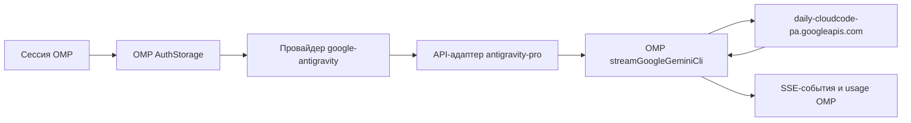

# omp-antigravity-pro: полное руководство

[Главная страница](../README.md) | [English version](GUIDE.en.md)

## 1. Назначение

`omp-antigravity-pro` — расширение Oh My Pi для встроенного провайдера `google-antigravity`. Оно исправляет формат запросов Gemini 3.6 Flash в Antigravity, не заменяя штатную авторизацию, планировщик аккаунтов, сетевой транспорт и SSE-парсер OMP.

Расширение нужно потому, что production endpoint Cloud Code Assist использует для Gemini 3.6 Flash числовые бюджеты размышления и отдельные wire ID моделей для разных уровней effort. Старый каталог OMP может описывать эту же модель через протокол Google `thinkingLevel`, который не соответствует перехваченному формату Antigravity и способен приводить к пустым ответам.

## 2. Архитектура



ID провайдера остаётся `google-antigravity`. Это принципиально: существующие OAuth-записи, `/usage`, cooldown аккаунтов, привязка аккаунта к сессии и failover продолжают относиться к тому же провайдеру.

Расширение регистрирует отдельный custom API ID `antigravity-pro`, потому что OMP запрещает переопределять встроенные API ID. Перед делегированием адаптер восстанавливает на wire-модели штатный API `google-gemini-cli` и production endpoint Antigravity.

### За что отвечает расширение

- проецирует установленный каталог Antigravity на API `antigravity-pro`;
- добавляет Gemini 3.6 Flash, если её нет в старой версии каталога;
- выбирает wire ID Gemini 3.6 Flash по effort;
- преобразует effort Gemini 3.6 Flash в числовой thinking budget;
- принудительно использует production daily endpoint;
- адаптирует общие stream options OMP к штатному Google-транспорту.

### Что продолжает делать OMP

- OAuth login и refresh;
- хранение credentials и работа с несколькими аккаунтами;
- выбор аккаунта внутри сессии;
- состояние квот и cooldown;
- безопасный для replay повтор с другим credential;
- request envelope и схемы инструментов;
- HTTP, SSE parsing, stream timeout, retry пустого потока и abort;
- `thoughtSignature`, token usage и расчёт стоимости.

## 3. Требования

- Oh My Pi 17.x;
- Node.js 20 или новее для установки зависимостей и typecheck;
- настроенный в OMP OAuth-аккаунт Google Antigravity;
- Bun нужен только для тестов при разработке.

Расширение проверено в реальном запуске с `omp/17.2.0`, когда установленные peer-пакеты OMP сообщали версию `17.0.1`.

## 4. Установка

Установка напрямую с GitHub:

```bash
omp plugin install github:ART1KZ/omp-antigravity-pro
```

Проверка состояния плагина:

```bash
omp plugin list
omp plugin doctor
```

Проверка каталога провайдера:

```bash
omp models google-antigravity
```

В списке должна присутствовать модель:

```text
google-antigravity/gemini-3.6-flash
```

### Локальная установка для разработки

```bash
git clone https://github.com/ART1KZ/omp-antigravity-pro.git
cd omp-antigravity-pro
npm install
omp plugin link . --scope user
```

Связанный плагин загружается непосредственно из рабочей директории, поэтому после каждого изменения исходников переустанавливать его не нужно.

## 5. Авторизация и несколько аккаунтов

Расширение не создаёт собственные credential-файлы и не хранит открытый JSON-пул аккаунтов. Оно использует штатные функции входа и обновления токена Google Antigravity из OMP.

Если вы уже пользуетесь `google-antigravity`, существующие аккаунты остаются под тем же provider ID. Если авторизации ещё нет:

1. запустите `omp`;
2. выполните `/login`;
3. выберите Google Antigravity;
4. завершите OAuth в браузере;
5. повторите вход, если хотите добавить ещё один аккаунт.

Cloud Code transport требует access token и `projectId`. Расширение сериализует OAuth-запись OMP в structured credential штатного транспорта. Если в старой записи нет `projectId`, расширение выдаёт понятное требование повторного входа вместо отправки заведомо неправильного запроса.

### Refresh и failover

Восстановлением credentials управляет OMP:

- обычный `401`: сначала refresh того же аккаунта, затем переход на соседний аккаунт при необходимости;
- инвалидированный credential или ограничение аккаунта/квоты: прямой переход на соседний аккаунт;
- retry происходит только пока replay безопасен, то есть до выдачи содержимого ответа вызывающему коду;
- количество проверяемых credentials ограничено, бесконечного цикла быть не должно.

Состояние квот можно посмотреть командой:

```bash
omp usage
```

## 6. Модели и thinking

Расширение начинает с полного bundled-каталога `google-antigravity` из установленного пакета OMP. Оно сохраняет названия, возможности, типы входа, стоимость, лимиты, заголовки, premium multiplier и thinking metadata, после чего переключает модели на custom API.

Если установленный каталог старше Gemini 3.6 Flash, compatibility model создаётся на основе полной runtime-модели Gemini 3.5 Flash. Благодаря этому сохраняются resolved compat metadata и другие обязательные поля, а не создаётся неполный объект вручную.

### Gemini 3.6 Flash

| Effort пользователя | Wire ID модели | `thinkingBudget` |
| --- | --- | ---: |
| `minimal` | `gemini-3.6-flash-low` | 1 000 |
| `low` | `gemini-3.6-flash-low` | 1 000 |
| `medium` | `gemini-3.6-flash-medium` | 4 000 |
| `high` | `gemini-3.6-flash-high` | 10 000 |

Gemini 3.6 Flash требует выбранный effort. Пример запуска:

```bash
omp --model google-antigravity/gemini-3.6-flash --thinking medium
```

Остальные модели Antigravity сохраняют thinking-семантику установленного OMP. Модели с Google level protocol получают `thinkingLevel`, а модели в budget mode — `thinkingBudget`.

## 7. Жизненный цикл запроса

1. OMP выбирает модель `google-antigravity` и аккаунт.
2. OMP преобразует аккаунт в structured credential.
3. Custom API adapter получает модель, контекст и общие stream options.
4. Адаптер определяет wire ID модели и thinking configuration.
5. Он устанавливает `antigravityEndpointMode: "production"` и возвращает wire-модели API `google-gemini-cli`.
6. `streamGoogleGeminiCli` создаёт envelope Cloud Code Assist и отправляет POST на:

   ```text
   https://daily-cloudcode-pa.googleapis.com/v1internal:streamGenerateContent?alt=sse
   ```

7. OMP разбирает SSE и передаёт текст, thinking, tool calls, signatures, usage, ошибки и завершение.
8. При retryable ошибке авторизации или квоты до выдачи replay-unsafe данных OMP запрашивает refresh или соседний аккаунт и повторяет запрос.

Sandbox endpoint расширение не использует.

## 8. Кэширование

Кэширование нужно измерять, а не предполагать.

Расширение не сортирует инструменты, не переписывает system prompt, не меняет историю и не нормализует пользовательский текст. Стабильный префикс доходит до OMP transport без изменений, поэтому расширение не уничтожает потенциальную возможность серверного кэширования.

Но ни расширение, ни штатный Antigravity transport OMP не создают explicit cached-content resource. Транспорт только читает поле ответа Antigravity:

```text
usageMetadata.cachedContentTokenCount
```

OMP показывает его как:

```text
usage.cacheRead
```

Следствия:

- `cacheRead > 0` — сервер сообщил о cached input tokens;
- `cacheRead = 0` — cache hit не подтверждён;
- `cacheWrite` остаётся `0`, потому что транспорт не выполняет explicit cache write;
- одинаковые prompts не гарантируют одинаковое поведение кэша;
- расширение не обещает фиксированный процент cache hit или экономии квоты.

### Как проверить

Запустите запрос в JSON mode:

```bash
omp \
  --model google-antigravity/gemini-3.6-flash \
  --thinking medium \
  --mode json \
  --no-tools \
  --no-skills \
  --no-rules \
  --no-session \
  -p "Повторяемый запрос"
```

Найдите событие `message_end` ассистента и проверьте:

```json
{
  "usage": {
    "input": 3491,
    "cacheRead": 0,
    "cacheWrite": 0
  }
}
```

Только положительный `cacheRead` доказывает попадание в кэш. Для осмысленного эксперимента используйте достаточно длинный одинаковый префикс, одну модель и effort, неизменные system prompts и tools. Делайте несколько измерений: implicit server caching не является детерминированной или гарантированной частью контракта.

## 9. Решение проблем

### Нет Gemini 3.6 Flash

```bash
omp plugin list
omp plugin doctor
omp models google-antigravity
```

Если плагин отсутствует или отключён, переустановите его:

```bash
omp plugin uninstall omp-antigravity-pro
omp plugin install github:ART1KZ/omp-antigravity-pro
```

### Отсутствует `projectId`

OAuth-запись неполная. Запустите OMP, выполните `/login` и снова авторизуйте Google Antigravity. Не редактируйте credential storage вручную.

### Установлено другое расширение Antigravity

Два расширения, переопределяющие `google-antigravity`, могут зависеть от порядка загрузки. Отключите или удалите другой override, выполните `omp plugin doctor` и снова проверьте каталог.

### Пустой ответ

Убедитесь, что выбраны `google-antigravity/gemini-3.6-flash` и поддерживаемый effort. Запустите OMP в JSON mode для просмотра terminal error. Расширение уже фиксирует production routing и числовые budgets 3.6, но постоянные пустые ответы всё равно могут быть вызваны доступностью upstream, eligibility аккаунта или постепенным rollout модели.

### Ошибка 400 (User location is not supported)

Если Google возвращает `Cloud Code Assist API error (400): User location is not supported for the API use`, это вызвано региональной блокировкой IP-адреса со стороны Google.

Для решения проблемы настройте обратный прокси (например, Cloudflare Worker, проксирующий `daily-cloudcode-pa.googleapis.com`):
1. Разверните Cloudflare Worker со скриптом перенаправления запросов на `daily-cloudcode-pa.googleapis.com`.
2. Укажите URL воркера в переменной окружения `ANTIGRAVITY_BASE_URL` (в системных переменных или в файле `~/.omp/agent/.env`):
   ```bash
   ANTIGRAVITY_BASE_URL=https://your-worker.workers.dev
   ```
3. Плагин автоматически перенаправит все запросы через указанный Worker/прокси, обходя географические ограничения.

### Ошибка квоты

Выполните `omp usage`. OMP может переключаться только между настроенными и доступными sibling credentials. Если лимит исчерпан на всех аккаунтах, дождитесь reset или добавьте ещё один разрешённый аккаунт.

## 10. Модель безопасности

- нет собственной базы credentials;
- нет plaintext JSON-пула аккаунтов;
- токены не логируются;
- нет собственного OAuth client или callback server;
- пакет не включает сторонние runtime dependencies;
- внешние данные валидируются штатным OAuth parser и transport OMP.

JSON-логи сессии могут содержать prompts и ответы модели, поэтому их тоже следует считать потенциально чувствительными, даже если OAuth tokens туда не попадают.

## 11. Разработка и проверка

```bash
npm install
npm run typecheck
npm run lint
npm test
npm run pack:check
```

Контрактные тесты проверяют:

- сохранение полного каталога и fallback Gemini 3.6;
- numeric budgets и wire routing;
- использование только production endpoint;
- передачу context, messages, tools и diagnostic callbacks;
- structured OAuth credentials и валидацию отсутствующего project ID;
- штатный SSE parser, usage и `thoughtSignature`;
- replay-safe refresh после `401`;
- прямой sibling failover после quota response.

Живой smoke test:

```bash
omp \
  --model google-antigravity/gemini-3.6-flash \
  --thinking medium \
  --no-tools \
  --no-skills \
  --no-rules \
  --no-session \
  -p "Reply with exactly: OK"
```

## 12. Обновление и удаление

Обновление:

```bash
omp plugin upgrade omp-antigravity-pro
```

Удаление:

```bash
omp plugin uninstall omp-antigravity-pro
```

Удаление расширения намеренно не удаляет штатные OAuth-аккаунты `google-antigravity`. OMP продолжит использовать оставшуюся зарегистрированную реализацию провайдера.
